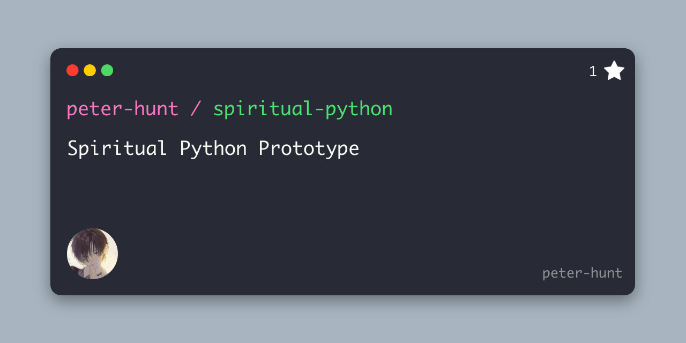

# Spiritual Python Prototype




This is the prototype of a MMORPG/metaverse game based on a sci-fi story in Python.

# Table of Contents
- [Spiritual Python Prototype](#spiritual-python-prototype)
- [Table of Contents](#table-of-contents)
- [License](#license)
- [Installation](#installation)
  - [Running](#running)

# License

[MIT](LICENSE.txt)

# Installation

All of the commands below are ran in the main `spiritual-python` repo folder.

For the first execution of this program, use `pip` to install the required libraries:

```bash
pip install -r requirements.txt
```

## Running

**This project requires Python 3.12+**

To run the project, use the following command:

```bash
python -m spiritual
```
